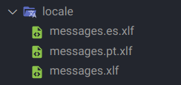
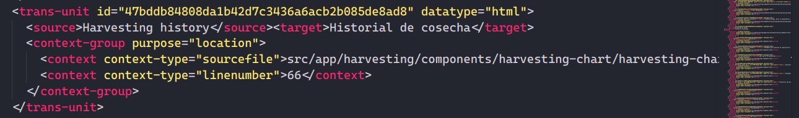

# Version

This project was generated with [Angular CLI](https://github.com/angular/angular-cli) version 15.2.5.
Angular v15 supports node.js versions: 14.20.x, 16.13.x and 18.10.x and supports TypeScript version 4.8 or later

## Description

This application is an Angular project that uses the PrimeNG and Angular Material libraries to create a rich and functional user interfaces. It provides a wide range of ready-to-use components and functionalities.

## Installation
1. Clone the application repository from GitHub.
2. Open the project folder in Visual Studio Code.
3. Open a new terminal
4. Execute the following command to install the project dependencies:
`npm install`

## Development server

If the "localize" property is set to "true", run `ng serve --configuration=es/en/pt` to start the server in a single language. If localize is set to "false", simply run `ng serve` for a dev server. Navigate to `http://localhost:4200/`. The app will automatically reload if you change any of the source files.

## Code scaffolding

Run `ng generate component component-name` to generate a new component. You can also use `ng generate directive|pipe|service|class|guard|interface|enum|module`.

## Localize

Run `ng extract-i18n` to generate an .xlf file with all the text marked with the i18n directive. Make 2 copies of that file, one named .es and the other .pt. After translating them, place the 3 files in the locale folder. This way, you will obtain 3 folders with the respective language when running `ng build`.

## Make translation corrections.

Inside the "locale" folder, you will find the "message.xlf" files. You should select the file associated with the language you want to correct.

Within this file, you will find "trans-unit" tags, and inside these tags, you will find two other tags called "source" and "target". The original text in English is located within the "source" tag, and the translation is inside the "target" tag.

To make corrections, simply modify the text inside the "target" tag. Afterward, save the changes and push them to the open pull request.

## Build

Run `ng build` to build the project. The build artifacts will be stored in the `dist/` directory. Use the `--prod` flag for a production build.

## Running unit tests

Run `ng test` to execute the unit tests via [Karma](https://karma-runner.github.io).

## Running end-to-end tests

Run `ng e2e` to execute the end-to-end tests via [Protractor](http://www.protractortest.org/).

## Further help

To get more help on the Angular CLI use `ng help` or go check out the [Angular CLI README](https://github.com/angular/angular-cli/blob/master/README.md).

